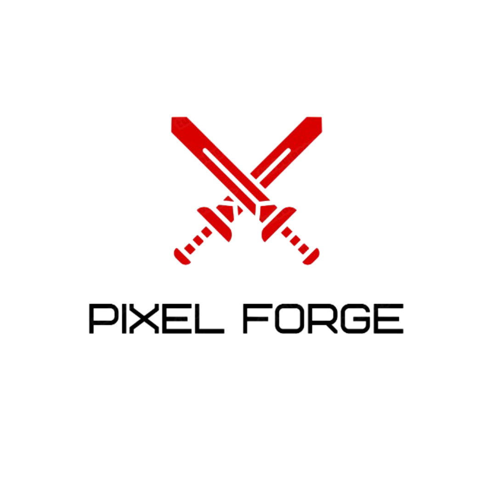
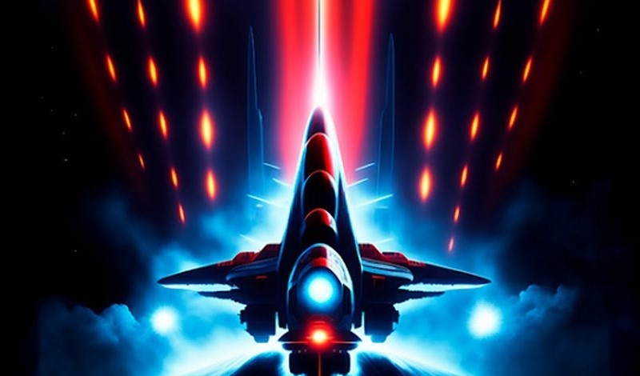
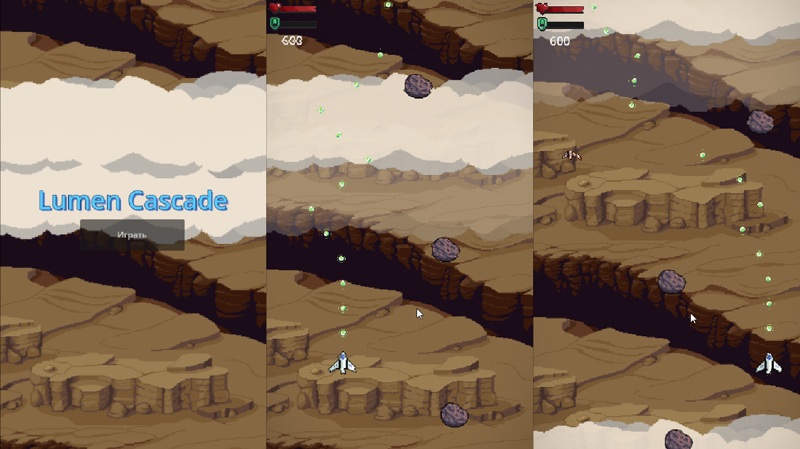
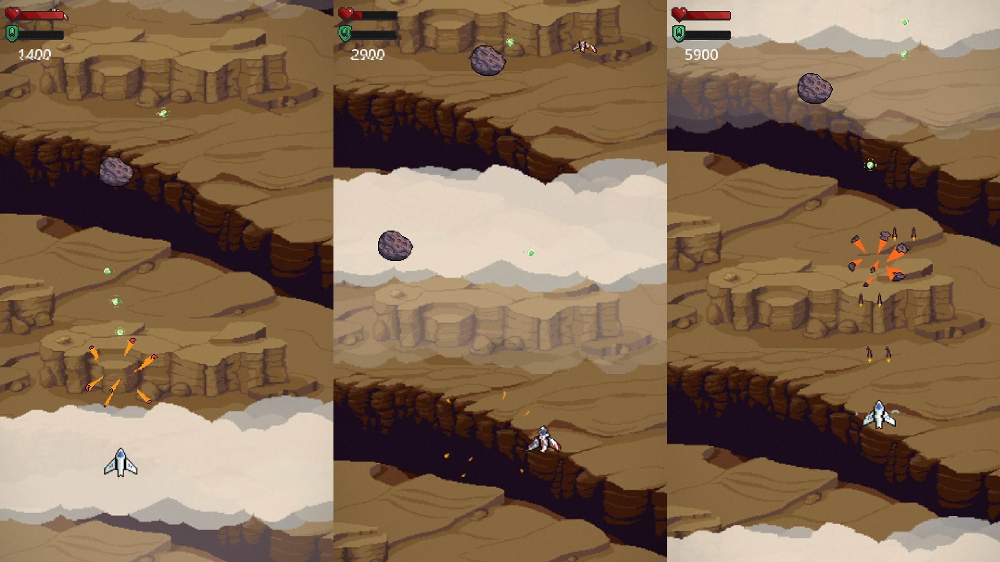

  

# Lumen Cascade

  

  <strong>Vertical space shooter</strong> · Godot 4.5 · RU / EN · <strong>Яндекс Игры</strong>

  
  
  

---

## О игре

**Lumen Cascade** — вертикальный космический шутер: управляй кораблём, сбивай врагов, собирай буффы и держись как можно дольше.

- Корабль с разными двигателями и оружием  
- Враги и боссы  
- Буффы (щит, усиления)  
- Взрывы и постобработка  
- Локализация: русский и английский  

## Скриншоты

<table>
<tr>
<td align="center"></td>
<td align="center"></td>
</tr>
</table>

## Управление

| Действие | Клавиши / Геймпад |
|----------|-------------------|
| Движение | WASD / стрелки / левый стик |
| Стрельба | ЛКМ / кнопка огня |
| Буст     | Space |
| Пауза   | ESC |

## Запуск

1. Установи [Godot 4.5](https://godotengine.org/download) (режим GL Compatibility).
2. Клонируй репозиторий и открой папку проекта в Godot.
3. Запусти сцену `main_menu` или нажми F5.

Экспорт под Desktop / Web / Android — через **Project → Export**.

**Ссылка на игру (Яндекс Игры):** добавь сюда URL после публикации.

## Структура проекта

| Папка / файл | Назначение |
|--------------|------------|
| `scenes/` | Сцены: игрок, враги, пули, буффы, UI (меню, HUD, game over) |
| `scripts/` | Логика: `yandex_games.gd` (обёртка SDK), меню, HUD, враги, пули |
| `assets/` | Спрайты, фоны, логотипы, анимации |
| `shaders/` | Heat distort, post-fx |
| `translations/` | Локализация (RU/EN) |
| `custom_html_shell.html` | HTML-оболочка для веб-экспорта с Яндекс SDK |

## Платформа Яндекс Игры

Игра разработана и публикуется на [Яндекс Играх](https://yandex.ru/games/). В веб-сборке используется **Yandex Games SDK v2**:

- **Player** — авторизация (`openAuthDialog`), данные игрока (`getPlayer`), локаль (`get_sdk_locale`)
- **Leaderboards** — отправка счёта (`setScore`), топ и позиция игрока (`getEntries`, `getPlayerEntry`)
- **Rewarded** — реклама за продолжение после Game Over (`showRewardedVideo`)
- **GameplayAPI** — старт/стоп геймплея, события паузы (`game_api_pause` / `game_api_resume`)
- **Flags** — A/B-флаги (`getFlags`)

Обёртка над SDK: `scripts/yandex_games.gd`; инициализация в `web_bild/index.html` и `custom_html_shell.html`.

## Технологии

- **Godot** 4.5, GDScript  
- Шейдеры (heat distort, post-fx)  
- Переводы через CSV  

## Сборка веб-версии (Яндекс Игры)

1. **Project → Export** → пресет HTML5.
2. В качестве **Custom HTML** укажи `custom_html_shell.html` (в нём уже подключён Yandex Games SDK v2).
3. Собери билд и залей на сервер / загрузи в кабинет разработчика Яндекс Игр.

## Лицензия

Проект представлен в образовательных целях. Ресурсы (спрайты, музыка) могут иметь свои лицензии.

---

  

  SPRITE-FORGE

